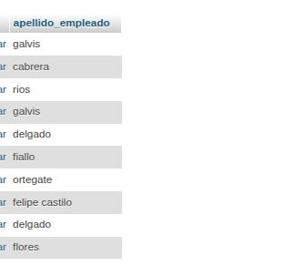
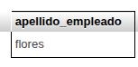
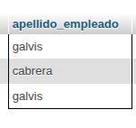
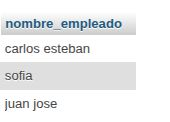
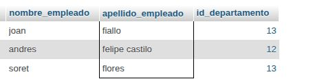
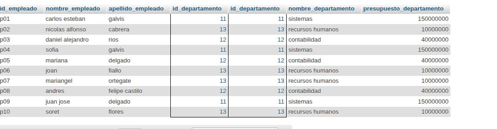
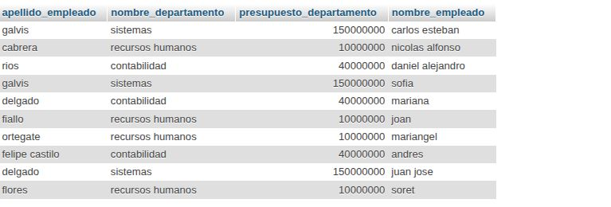
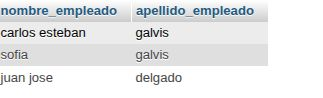
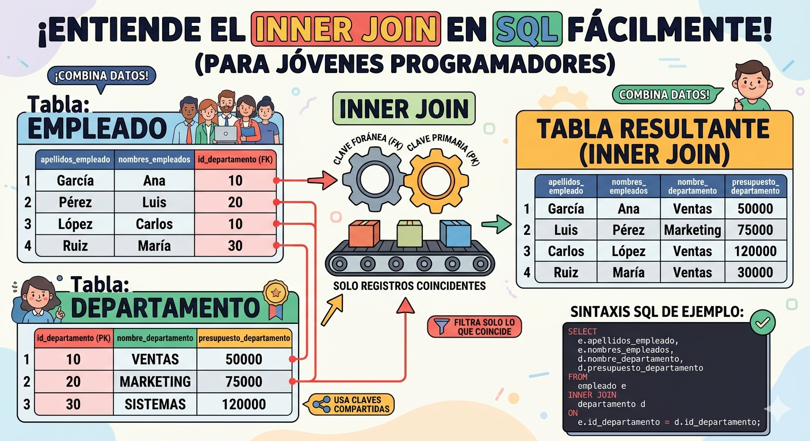
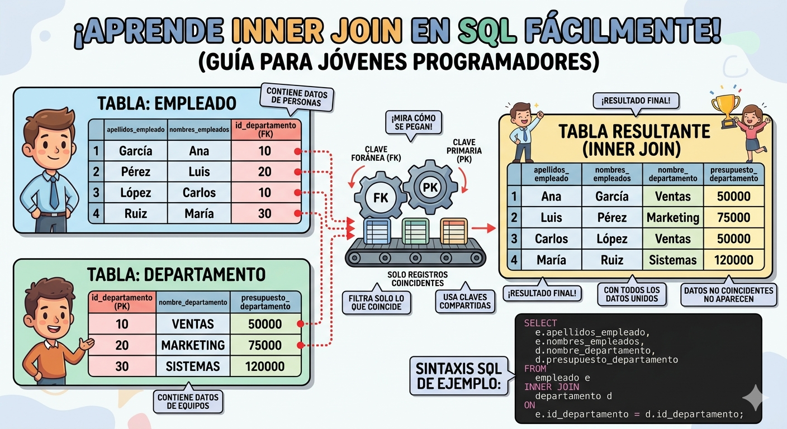

# consultas2_sql

## Modelo Físico de la Base de Datos

---

## Creación de la Base de Datos

1. Empleados De la Empresa

2. Tabla de el Departamento

## Consultas de la base de datos.

1. Obtener la lista de los apellidos de todos los empleados.

`SELECT apellidos_empleado FROM Empleado;`

2. Obtener los apellidos de todos los empleados sin repeticiones.

`SELECT DISTINCT apellidos_empleado FROM Empleado;`

3. Obtener todos los datos de los empleados que se apellidan 'flores'.

`SELECT * FROM Empleado WHERE apellidos_empleado LIKE 'flores`

4. Obtener todos los datos de los empleados que se apellidan "cabrera" y los que se apellidan "galvis".  Usar OR o IN

`SELECT * FROM Empleado WHERE apellidos_empleado LIKE 'cabrera%' OR apellidos_empleado LIKE 'galvis%`

5. Obtener los nombres de los empleados que trabajan en el departamento 11

`SELECT nombre_empleado FROM Empleado WHERE id_departamento = 11;`

6. Obtener todos los datos de los empleados cuyo apellido empiece por 'f'

`SELECT * FROM Empleado WHERE apellidos_empleado LIKE 'P%';`

7. Obtener el presupuesto total de todos los departamentos.

`SELECT SUM(presupuesto_departamento) AS total_presupuesto FROM Departamento;`

8. Obtener el número de empleados de cada departamento.

`SELECT id_departamento, COUNT(*) AS cantidad_empleados FROM Empleado GROUP BY id_departamento;`

9. Obtener un listado completo de empleados, incluyendo por cada empleado los datos del empleado y de su departamento.

`SELECT * FROM Empleado, Departamento WHERE Empleado.id_departamento = Departamento.id_departamento;`

10. Obtener un listado completo de empleados, incluyendo el nombre y apellidos del empleado junto al nombre y presupuesto de su departamento.

`SELECT nombre_empleado,apellidos_empleado,nombre_departamento, presupuesto_departamento FROM Empleado, Departamento WHERE Empleado.id_departamento = Departamento.id_departamento;`

11. Obtener los nombres y apellidos de los empleados que trabajen en departamentos cuyo presupuesto sea mayor a 100000000

`SELECT nombre_empleado, apellidos_empleado FROM Empleado, Departamento WHERE Empleado id_departamento = Departamento id_departamento AND presupuesto_departamento > 100000000;`

# clausula inner juin
El Concepto Central (Analogía): Imagina que el INNER JOIN es un "Súper Pegamento" que solo une cosas que encajan perfectamente. No pega cualquier cosa, solo lo que tiene una "llave" y una "cerradura" que coinciden.

Las Tablas Originales (La entrada): A la izquierda, verás las dos tablas que vamos a unir:

Tabla DEPARTAMENTO: Es como una lista de "habitaciones" o equipos (Ventas, Marketing, etc.). Cada uno tiene un número de ID (la llave principal).

Tabla EMPLEADO: Es la lista de personas. Cada persona tiene una etiqueta que dice a qué departamento pertenece (el id_departamento, que es la cerradura o Foreign Key).

La Magia del INNER JOIN (El proceso): El motor de la base de datos toma a un empleado (digamos, "Ana") y mira su código de departamento (ej: 101). Luego, va a la tabla de departamentos y busca exactamente el departamento 101 (Ventas).

El Resultado (La salida): Solo si hay una coincidencia exacta, se crea una nueva fila combinada en la tabla de la derecha. Si un empleado tiene un código de departamento que no existe, o si un departamento no tiene empleados, esos datos no aparecen en el resultado final. ¡El pegamento solo une parejas perfectas!

Solo si hay una coincidencia exacta, se crea una nueva fila combinada en la tabla de la derecha. Si un empleado tiene un código de departamento que no existe, o si un departamento no tiene empleados, esos datos no aparecen en el resultado final. ¡El pegamento solo une parejas perfectas!

